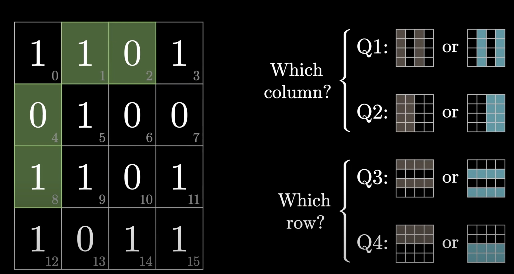

# Hamming-Code

Hamming code is a block code that is capable of detecting up to two simultaneous bit errors and correcting single-bit errors. In mathematical terms, Hamming codes are a class of binary linear codes. It is executed by encoding the original message with a series of redundant bits in positions of the powers of two and the number of occurrences of these extra bits is determined according to an inequality. This specific positioning makes it possible to detect and correct the errors of transmission i.e the receivers of the message can perform recalculations to detect errors and find the bit position of the erroneous bit if it exists.

### Use of my HammingCode class.
* Constructor - HammingCode( param1 , param2 ).
```
HammingCode( param1 , param2 )
# param1 is the message, it can be string, list of binary bits.
# param2 is Boolean, true for when passing message to encode, false for when passing message to check for error or decode.
```

* Methods
```
encode() 
decode() 
checkForError() 
```

### Efficiency
parity bits are needed for every 2*i bits. Meaning that the efficiency increases with larger the data.

### For deeper explanation check out this youtube video (not my video)
* <a href="https://www.youtube.com/watch?v=X8jsijhllIA&ab_channel=3Blue1Brown" target="_blank">Hamming codes, h■w to ov■rco■e n■ise.</a>
